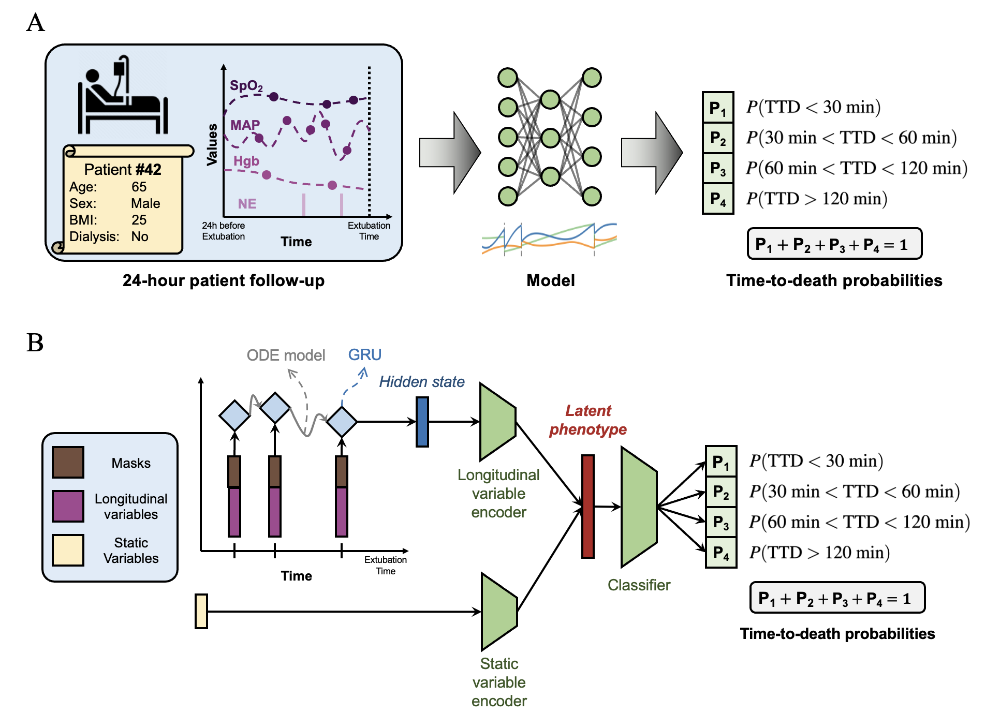

# Deep Learning for Organ Donation Time-to-Death Prediction

Official implementation of **"Deep learning unlocks the true potential of organ donation after circulatory death with accurate prediction of time-to-death"** published at *Nature Scientific Reports* (https://www.nature.com/articles/s41598-025-95079-7)

## Overview
This repository contains the implementation of deep learning models for time-to-death prediction after circulatory death (DCD). Among many potential models for this purpose, we propose to use ODE-RNN, which overcomes the computational challenges of irregular, sparse clinical time-series data and effectively integrates clinical history. It outperforms existing approaches on external validations, especially the widely-used clinical risk scores, thereby facilitating organ donation preparation.

## Citation
If you find this work useful, please cite our paper:
```bibtex
@article{sun2025deep,
  title={Deep learning unlocks the true potential of organ donation after circulatory 
  death with accurate 
  prediction of time-to-death},
  author={Sun, Xingzhi and De Brouwer, Edward and Liu, Chen and Krishnaswamy, Smita and 
  Batra, Ramesh},
  journal={Scientific Reports},
  volume={15},
  number={1},
  pages={13565},
  year={2025},
  publisher={Nature Publishing Group UK London}
}
```

## A method that integrates static and irregularly-sampled longitudinal variables


## Abstract
Increasing the number of organ donations after circulatory death (DCD) has been identified as one of the most important ways of addressing the ongoing organ shortage. While recent technological advances in organ transplantation have increased their success rate, a substantial challenge in increasing the number of DCD donations resides in the uncertainty regarding the timing of cardiac death after terminal extubation, impacting the risk of prolonged ischemic organ injury, and negatively affecting post-transplant outcomes. In this study, we trained and externally validated an ODE-RNN model, which combines recurrent neural network with neural ordinary equations and excels in processing irregularly-sampled time series data. The model is designed to predict time-to-death following terminal extubation in the intensive care unit (ICU) using the history of clinical observations. Our model was trained on a cohort of 3,238 patients from Yale New Haven Hospital, and validated on an external cohort of 1,908 patients from six hospitals across Connecticut. The model achieved accuracies of 95.3$\pm$1.0% and 95.4\pm0.7% for predicting whether death would occur in the first 30 and 60 minutes, respectively, with a calibration error of 0.024$\pm$0.009. Heart rate, respiratory rate, mean arterial blood pressure (MAP), oxygen saturation (SpO2), and Glasgow Coma Scale (GCS) scores were identified as the most important predictors. Surpassing existing clinical scores, our model sets the stage for reduced organ acquisition costs and improved post-transplant outcomes.

## Models
- **GRU-dt**: Gated Recurrent Unit with delta time
- **GRU-D**: Gated Recurrent Unit with Decay
- **ODE-RNN**: Neural Ordinary Differential Equation Recurrent Neural Network

## RNN Variants
We experiment with different recurrent architectures:
- **RNN**: Simple Recurrent Neural Network
- **LSTM**: Long Short-Term Memory
- **GRU**: Gated Recurrent Unit
